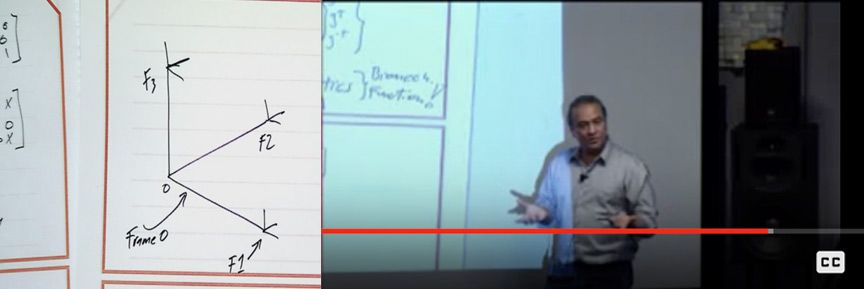

# Fundamentals of Neuromechanics
Francisco J. Valero-Cuevas © 2015
Springer Biosystems & Biorobotics Series, Volume 8

## [Download book PDF](https://link.springer.com/content/pdf/10.1007/978-1-4471-6747-1.pdf)  
>If you are at an institution subscribed to SpringerLink, you should see the PDF.  
Otherwise, you will be directed to the SpringerLink page.  

[View book on Amazon](https://www.amazon.com/Fundamentals-Neuromechanics-Biosystems-Biorobotics-Valero-Cuevas/dp/1447167465/ref=sr_1_1?ie=UTF8&qid=1451158117&sr=8-1&keywords=valero-cuevas)  

[Professors: Click here to request a desk copy](https://www.springer.com/services+for+this+book?SGWID=0-1772415-3261-0-9781447167464)  

This book provides a conceptual and computational framework to study how the nervous system exploits the anatomical properties of limbs to produce mechanical function. The study of the neural control of limbs has historically emphasized the use of optimization to find solutions to the muscle redundancy problem. That is, how does the nervous system select a specific muscle coordination pattern when the many muscle of a limb allow for multiple solutions?  
I revisit this problem from the emerging perspective of neuromechanics that emphasizes finding and implementing families of feasible solutions, instead of a single and unique optimal solution. Those families of feasible solutions emerge naturally from the interactions among the feasible neural commands, anatomy of the limb, and constraints of the task. Such alternative perspective to the neural control of function is not only biologically plausible, but sheds light on the most central tenets and debates in the fields of neural control, robotics, rehabilitation, and brain-body co-evolutionary adaptations. This perspective developed from courses I taught to engineers and life scientists at Cornell University and the University of Southern California, and is made possible by combining fundamental concepts from mechanics, anatomy, robotics and neuroscience with advances in the field of computational geometry.  
*Fundamentals of Neuromechanics* is intended for neuroscientists, roboticists, engineers, physicians, evolutionary biologists, athletes, and physical and occupational therapists seeking to advance their understanding of neuromechanics. Therefore, the tone is decidedly pedagogical, engaging, integrative and practical to make it accessible to people coming from a broad spectrum of disciplines. I attempt to tread the line between making the mathematical exposition accessible to life scientists, and convey the wonder and complexity of neuroscience to engineers and computational scientists. While no one approach can hope to definitively resolve the important questions in these related fields, I hope to provide you with the fundamental background and tools to allow you to contribute to the emerging field of neuromechanics.

# Companion Website

1. [Chapter 1](../book_chapters/ch1.html)
2. [Chapter 2](../book_chapters/ch2.html)
3. [Chapter 3](../book_chapters/ch3.html)
4. [Chapter 4](../book_chapters/ch4.html)
5. [Chapter 5](../book_chapters/ch5.html)
6. [Chapter 6](../book_chapters/ch6.html)
7. [Chapter 7](../book_chapters/ch7.html)
8. [Chapter 8](../book_chapters/ch8.html)
9. [Chapter 9](../book_chapters/ch9.html)
10. [Chapter 10](../book_chapters/ch10.html)

## Companion video lectures from USC BME 504

- [2016 Lectures](https://drive.google.com/drive/folders/1x3TWLDn7Yz3bLHQc-FohxfRXaPI9DLHp?usp=sharing)  
- [2015 Lectures](https://drive.google.com/drive/folders/1PW2yRQ-04TbCG_4GdZHywW8o4WT0aBsL?usp=sharing)  
- [2013 Lectures](https://drive.google.com/drive/folders/1T1rY-ylBrSXsyCUVr-18hoJ1KcPHo5Di?usp=sharing)  

## Extended Resources
- [Book Exercises by Chapter(.pdf)](https://github.com/usc-bbdl/usc-bbdl.github.io/files/72510/Exercises_V1_0.pdf)  
- [Numerical Code (.zip)](https://github.com/usc-bbdl/usc-bbdl.github.io/files/72511/Numerical_Code_V1_0.zip)  
- [Download Product Flyer](book_chapters/fundamentals_flyer.pdf)

<head>
  
</head>
<body>
<button onclick="topFunction()" id="myBtn" title="Go to top">Top</button>
<!-- scroll to top button -->

</body>
